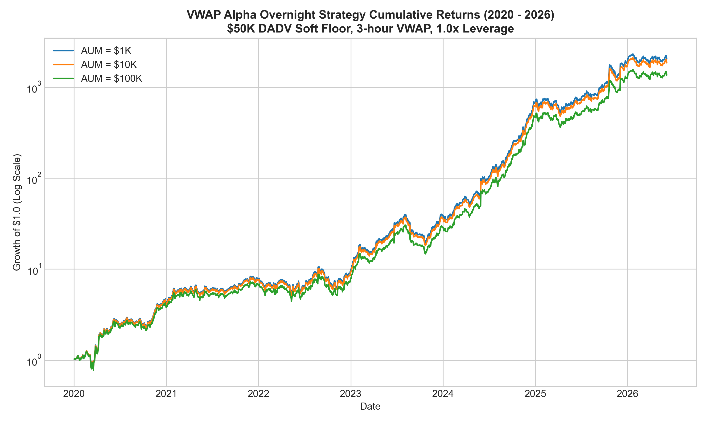

# Nonlinear Liquidity Reversion (NLR) Strategy
**Proprietary Quantitative Research -- Execution Horizon & Capacity Study**  
*Confidential -- Internal Distribution Only -- July 2026*

---

## Strategy Overview
The **Nonlinear Liquidity Reversion (NLR) Strategy** is a systematic quantitative equity strategy designed to capture overnight mean-reversion anomalies within the Russell 3000 universe. By analyzing cross-sectional deviations between intraday mid-price proxies and official close prices, the strategy isolates short-term flow imbalances that statistically reverse during the overnight (Close-to-Open) session.

To operate under realistic retail frictions, the strategy employs a **3-day hold tranche rebalancing** structure and routes exits via a **3-hour volume-weighted average price (VWAP) algorithm** to manage nonlinear price impact.

---

## Strategy Profile
* **Investment Universe**: US Small/Micro-Cap Equities (Russell 3000).
* **Position Sizing**: Inverse Volatility (Risk-Parity).
* **Holding Period**: 3-Day Tranche Rebalancing.
* **Leverage**: 1.0x (No borrowing interest drag, zero margin call risk).
* **Execution**: 3-Hour VWAP Algo (Exits).

---

## Key Performance Metrics (2020 - 2026)

| Metric | Value |
| :--- | :---: |
| **Net Sharpe Ratio** | **1.492** |
| **Net Annualized Return (CAGR)** | **91.04%** |
| **Max Drawdown** | -57.45% |
| **Inception Date** | January 2020 |
| **Terminal Capacity Limit** | \$2.5M -- \$3.0M AUM |
| **Min Starting Capital** | \$10,000 |

---

## Strategy Equity Curve (PnL Growth)

*Figure 1: Growth of \$1.0 invested since Jan 2020 (Log Scale). Net of 3-hour VWAP slippage, commissions, and spreads.*

---

## Repository Contents
* `paper.tex`: Complete LaTeX source code for the quantitative research paper.
* `tearsheet.tex`: LaTeX source for the 1-page strategy fact sheet.
* `presentation.tex`: LaTeX Beamer source for the 10-slide investor pitch deck.
* `pnl_chart_2020_2026.png`: Cumulative returns chart (2020-2026).
* `pnl_chart_2023_2026.png`: Cumulative returns chart re-based (2023-today).

---

## License
Licensed under the **Creative Commons Attribution-NonCommercial 4.0 International (CC BY-NC 4.0)**. Commercial exploitation of this strategy or research is strictly prohibited.
